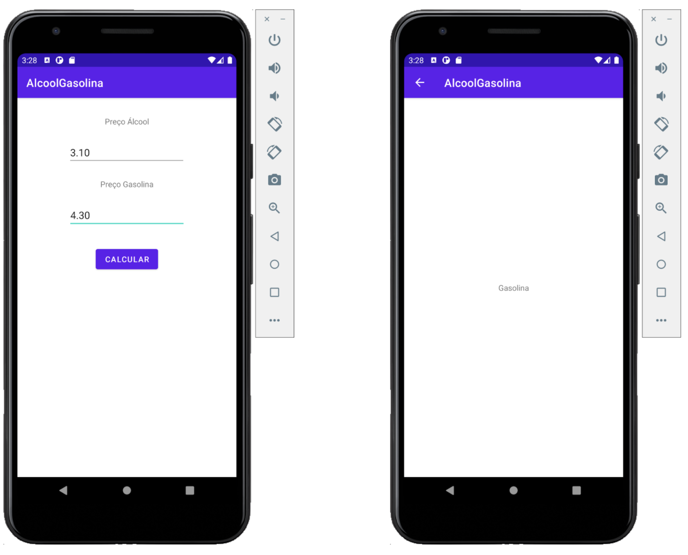

# FIAP - Projetos Android
## ExemploLinearLayout
Exemplo em aula do uso do Linear Layout.

 

## AlcoolGasolina
Aplicativo para calcular qual combustível é mais vantajoso. Este exemplo utiliza **ConstraintLayout** e **Intents**.

 